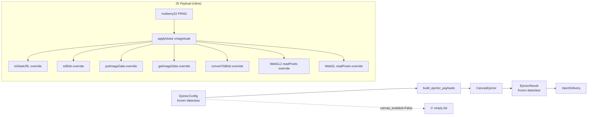

# BATCH-36 / TASK-01 — Canvas Noise Injector + Ejector Framework

**Date:** 2026-05-13  
**Status:** ✅ COMPLETE  
**Agent:** Craft Agent (AIV v5.3)

---

## Deliverables

| # | File | Purpose | Lines |
|---|------|---------|-------|
| 1 | `src/super_browser/stealth/ejecta/__init__.py` | Package init — re-exports `build_ejector_payloads`, `EjectorConfig`, `EjectorResult` | 22 |
| 2 | `src/super_browser/stealth/ejecta/config.py` | `EjectorConfig` frozen dataclass with canvas/audio toggles and noise magnitude | 36 |
| 3 | `src/super_browser/stealth/ejecta/types.py` | `EjectorResult` frozen dataclass — payload container | 28 |
| 4 | `src/super_browser/stealth/ejecta/registry.py` | `build_ejector_payloads()` — assembles enabled ejectors, returns sorted by inject_order | 40 |
| 5 | `src/super_browser/stealth/ejecta/canvas.py` | `CanvasEjector` — generates JS IIFE with 7 canvas API overrides + inline mulberry32 PRNG | 180 |
| 6 | `tests/test_ejecta/test_canvas.py` | 8 test classes (26 test methods) — TEST-36-01-01 through TEST-36-01-08 | 178 |

---

## Quality Gates

| Gate | Command | Result |
|------|---------|--------|
| Lint | `python -m ruff check src/super_browser/stealth/ejecta/` | ✅ **0 warnings** |
| Tests | `python -m pytest tests/test_ejecta/test_canvas.py -v` | ✅ **26/26 passed** (0.19s) |

---

## Test Coverage Matrix

| Test ID | Class | Assertion Count | What it validates |
|---------|-------|-----------------|-------------------|
| TEST-36-01-01 | `TestEjectorConfigFrozen` | 1 | `EjectorConfig` is frozen — rejects attribute assignment |
| TEST-36-01-02 | `TestEjectorConfigDefaults` | 6 | All 6 defaults: `canvas_enabled=True`, `canvas_noise_magnitude=2`, `audio_enabled=True`, `audio_noise_magnitude=0.0001`, `profile_id=""`, `seed="default"` |
| TEST-36-01-03 | `TestEjectorResultFields` | 4 | `EjectorResult` stores `ejector_id`, `js_payload`, `inject_order`, `size_bytes` correctly |
| TEST-36-01-04 | `TestEjectorResultFrozen` | 1 | `EjectorResult` is frozen — rejects attribute assignment |
| TEST-36-01-05 | `TestCanvasEjectorGenerate` | 5 | `CanvasEjector.generate()` returns valid `EjectorResult` with correct type, non-empty payload, matching size_bytes, int order |
| TEST-36-01-06 | `TestPayloadOverrides` | 7 | JS payload contains all 7 API override strings (toDataURL, toBlob, putImageData, getImageData, convertToBlob, WebGL2.readPixels, WebGL.readPixels) |
| TEST-36-01-07 | `TestDeterminism` | 3 | Same config → same payload; different seed → different payload; different profile_id → different payload |
| TEST-36-01-08 | `TestBuildEjectorPayloads` | 5 | Returns list, canvas_enabled produces canvas result, canvas_disabled omits it, results ordered by inject_order, all sizes > 0 |

---

## Architecture

### Seed Derivation

- **Python side**: `SHA-256(profile_id + ':' + seed)` → first 4 bytes → u32 LE → embedded as JS `_seed` constant
- **JS side**: `mulberry32()` advances state on each call → `Math.floor(mulberry32() * (2*MAG+1)) - MAG` → integer noise in `[-2, +2]`
- **Pixel clamp**: `Math.max(0, Math.min(255, pixel + noise))`

### Noise Model

For every RGBA byte in every overridden canvas call:
1. Advance the PRNG
2. Compute noise = `floor(PRNG() × (2×M + 1)) - M` where M = `canvas_noise_magnitude`
3. Add noise, clamp to `[0, 255]`

---

## Design Decisions

1. **Mulberry32 over xoshiro256** — The JS PRNG needs to be lightweight, single-u32 state, and inline. Mulberry32 fits perfectly. The Python-side `Xoshiro256PRNG` stays in `consistency/prng.py` for matrix derivation — the JS payload is self-contained.

2. **Direct prototype assignment** — Each of the 7 overrides is written as a direct `X.prototype.method = function(...)` assignment rather than using a generic `patch()` helper. This makes the payload grep-friendly (test-36-01-06 validates literal substrings).

3. **Audio ejector placeholder** — `EjectorConfig` includes `audio_enabled` and `audio_noise_magnitude` fields ready for a future `AudioEjector` class. The registry has a commented placeholder.

4. **Frozen dataclasses** — Both `EjectorConfig` and `EjectorResult` are `@dataclass(frozen=True)`, matching the project-wide pattern (see `FingerprintMatrix`, `StealthConfig`).

5. **`size_bytes` from UTF-8** — `size_bytes` is computed as `len(js_payload.encode("utf-8"))`, not `len(js_payload)`, ensuring accurate byte counts for non-ASCII content.

---

## Integration Notes

The ejecta framework integrates with the existing stealth stack:

- **Upstream**: `EjectorConfig.seed` and `EjectorConfig.profile_id` should match the values used by `Xoshiro256PRNG` in `consistency/prng.py` for a coherent fingerprint identity.
- **Downstream**: `EjectorResult.js_payload` feeds directly into `InjectDelivery._js_payload` → CDP Fetch interception → `<script>` tag injection into `<head>`.
- **Ordering**: `CanvasEjector` uses `inject_order=10`. Future ejectors (audio=20, webgl=30, etc.) should use higher values so canvas noise is applied first.
