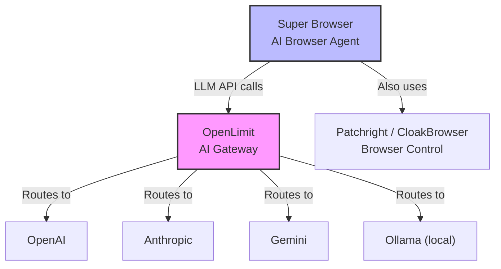

# OpenLimit — Competitive Analysis

**Date:** 2026-05-08  
**Analyst:** Lead Programmer  
**Version studied:** v1.1.2  
**Repository:** C:\Next-Era\OpenLimit (local)

---

## Executive Summary

OpenLimit is a **production-grade AI API gateway** written in Go — not a browser automation tool at all. It's the **control plane** that sits between applications and LLM providers (OpenAI, Anthropic, Gemini, etc.), providing governance, routing, caching, and observability.

**MIT Licensed** | **Go 1.25** | **34,107 LOC** | **378 tests** | **v1.1.2**

It's a **complement** to Super Browser, not a competitor. OpenLimit governs LLM API calls; Super Browser uses LLMs to control browsers.

---

## What OpenLimit IS

An **AI gateway** — think "Stripe for AI APIs":

```
Your App → OpenLimit Gateway → OpenAI / Anthropic / Gemini / etc.
              │
              ├── Virtual key auth (gw-xxx keys)
              ├── Rate limiting (RPM/TPM per key)
              ├── Budget caps (daily/monthly per key)
              ├── Input/output guardrails (content safety)
              ├── Caching (exact + semantic)
              ├── Circuit breakers (per provider:model:region)
              ├── Multi-provider routing (weighted + fallback)
              ├── MCP client + server mode
              ├── A2A 1.0 protocol support
              ├── Prompt management (versioned templates)
              ├── Admin dashboard (SPA embedded in binary)
              ├── 30+ Prometheus metrics
              └── OpenTelemetry tracing
```

---

## Key Features Deep Dive

### 1. Multi-Provider Routing
10 provider adapters: OpenAI, Anthropic, Gemini, Azure OpenAI, AWS Bedrock, Google Vertex, Groq, Cohere, Mistral, and any OpenAI-compatible endpoint (Ollama, vLLM).

**Weighted routing with fallbacks:**
```yaml
models:
  fast:
    routes:
      - provider: openai
        model: gpt-4o-mini
        weight: 100
    fallbacks:
      - provider: anthropic
        model: claude-3-5-haiku-latest
      - provider: ollama
        model: llama3.1
```

### 2. Virtual Key Governance
Virtual keys (`gw-` prefix) decouple provider keys from consumers. Per-key controls:
- RPM/TPM rate limits
- Daily/monthly budget caps in USD
- Allowed models (glob patterns)
- Allowed providers
- Allowed MCP tools (glob patterns)

### 3. Agent Protocol Support
- **MCP Client**: Connect to MCP servers, discover tools, merge into requests, execute multi-round agent loops with governance
- **MCP Server**: Expose virtual keys as tools for external agents
- **A2A 1.0**: Agent-to-agent task execution with SSE streaming (Redis Pub/Sub bridge for multi-instance)

### 4. Caching
- **Exact cache**: LRU in-memory + Redis
- **Semantic cache**: Embeddings-based similarity matching via pgvector
- **Tiered cache**: Exact → Semantic cascade

### 5. Guardrails Pipeline
- Input guardrails: keyword blocklist, webhook classifiers (with mTLS)
- Output guardrails: same pipeline on responses
- Configurable stages, short-circuit on block

### 6. Enterprise Features
- **KMS**: Static, AWS KMS, HashiCorp Vault (AES-256-GCM encryption)
- **OIDC SSO**: OpenID Connect JWT validation
- **RBAC**: admin, editor, viewer roles
- **Data residency**: region-aware routing
- **Redis Cluster**: shared state across pods
- **Helm chart**: Kubernetes-ready with HPA + ServiceMonitor

### 7. Observability
- 30+ Prometheus metrics
- OpenTelemetry tracing
- Grafana dashboard (JSON included)
- Structured logging (slog)
- X-Request-ID on every response
- X-Provider, X-Cache, X-Cost-USD response headers

---

## Architecture

### Tech Stack
- **Language**: Go 1.25
- **Database**: PostgreSQL 16 + pgvector
- **Cache**: Redis 7 (standalone + cluster)
- **Monitoring**: Prometheus + Grafana + OpenTelemetry
- **Deployment**: Docker Compose, Helm/Kubernetes
- **Build**: Makefile, multi-arch Docker (amd64 + arm64)
- **Binary**: 46MB single binary (SPA embedded via go:embed)

### Request Flow
```
Client Request
    ↓
Auth Middleware (virtual key → project → permissions)
    ↓
Rate Limiter (token bucket / Redis sliding window)
    ↓
Budget Check (Postgres spend tracking)
    ↓
Input Guardrails (keyword blocklist → webhook classifiers)
    ↓
Cache Lookup (exact → semantic → miss)
    ↓
Router (weighted selection + region awareness)
    ↓
Circuit Breaker (per provider:model:region)
    ↓
Provider Adapter (translate request → call provider API)
    ↓
Output Guardrails (same pipeline on response)
    ↓
Cache Store (if cacheable)
    ↓
Usage Logger (async batched → Postgres)
    ↓
Metrics Recorder (Prometheus)
    ↓
Response to Client
```

### Codebase Metrics
| Metric | Value |
|:-------|:------|
| Go source files | 167 (106 prod + 61 test) |
| Total LOC | 34,107 |
| Production LOC | 19,672 |
| Test LOC | 14,190 |
| Test-to-code ratio | 0.72:1 |
| Passing tests | 378 |
| Internal packages | 29 |
| DB migrations | 8 |
| Direct dependencies | 15 |
| Compiled binary | 46 MB |

### Largest Packages
| Package | LOC (prod + test) |
|:--------|:------------------|
| mcp | 8,363 |
| providers | 5,585 |
| api/openai | 3,592 |
| admin | 2,589 |
| guardrails | 1,854 |
| cache | 1,447 |
| config | 1,304 |

---

## How It Relates to Super Browser



**Super Browser = AI agent that controls browsers**  
**OpenLimit = Gateway that controls AI API access**

They solve different problems but **compose perfectly**:

1. **Super Browser calls OpenLimit** instead of calling OpenAI/Anthropic directly
2. OpenLimit adds budget governance, rate limiting, caching, guardrails
3. Super Browser gets multi-provider failover without code changes
4. OpenLimit's MCP server mode can expose Super Browser as a tool

---

## What OpenLimit Does (We Don't)

| Feature | OpenLimit | Super Browser |
|:--------|:----------|:--------------|
| LLM API gateway | ✅ Core product | ❌ Not our job |
| Virtual key management | ✅ gw-xxx keys | ❌ |
| Multi-provider routing | ✅ 10 providers | ❌ Direct LLM calls |
| Budget governance (API-level) | ✅ Per-key USD caps | ✅ Per-action caps (different scope) |
| Rate limiting (API-level) | ✅ RPM/TPM per key | ❌ |
| Semantic caching | ✅ pgvector embeddings | ❌ |
| Circuit breakers | ✅ Per provider:model:region | ❌ |
| Guardrails pipeline | ✅ Input + output stages | ✅ Safety gate (different scope) |
| Prompt management | ✅ Versioned templates | ❌ |
| MCP client/server | ✅ Full support | ✅ MCP server (10 tools) |
| A2A protocol | ✅ Agent-to-agent | ❌ |
| Admin dashboard | ✅ Embedded SPA | ❌ |
| Prometheus metrics | ✅ 30+ metrics | ❌ |
| OpenTelemetry | ✅ Full tracing | ❌ |
| Kubernetes/Helm | ✅ Production-ready | ✅ Docker only |

## What We Do (They Don't)

| Feature | Super Browser | OpenLimit |
|:--------|:--------------|:-----------|
| Browser automation | ✅ Core product | ❌ |
| LLM-powered agent | ✅ act(), delegate() | ❌ Just proxies calls |
| Stealth / anti-detection | ✅ CloakBrowser 57 C++ patches | ❌ |
| Human behavior simulation | ✅ Bézier mouse, typing | ❌ |
| Session recording | ✅ Record/replay/reports | ❌ |
| Agent memory | ✅ Per-domain learning | ❌ |
| Plugin system | ✅ Event bus + hooks | ❌ |
| Desktop CLI | ✅ interactive/script/act | ❌ CLI is admin-only |
| Browser fingerprint scoring | ✅ Numeric stealth score | ❌ |
| Recovery/checkpoints | ✅ State snapshots | ❌ |

---

## Integration Opportunities

### Option A: Super Browser routes LLM calls through OpenLimit

```python
# Instead of:
llm = create_llm(provider="anthropic", api_key="sk-ant-...")

# Use OpenLimit as the LLM endpoint:
llm = create_llm(
    provider="openai",  # OpenLimit exposes OpenAI-compatible API
    base_url="http://localhost:8080/v1",
    api_key="gw-virtual-key-here",
    model="fast"  # OpenLimit's logical model name
)
```

**Benefits:**
- Budget governance at the API level (OpenLimit tracks spend per key)
- Multi-provider failover (if OpenAI down → Anthropic → Ollama)
- Caching (identical requests get cached responses)
- Circuit breakers (don't hammer a failing provider)
- Rate limiting across all agent sessions
- Centralized prompt management
- Full observability (Prometheus + Grafana)

### Option B: OpenLimit's MCP Server exposes Super Browser as a tool

OpenLimit can already act as an MCP server. Super Browser already has an MCP server (10 tools). They could be chained:

```
Agent TARS / Claude → OpenLimit (MCP client) → Super Browser (MCP server)
                                              → "Navigate to example.com"
                                              → "Extract the price"
                                              → "Click the buy button"
```

### Option C: Share governance patterns
- OpenLimit's guardrails pipeline → inspiration for our safety gate
- OpenLimit's budget tracking → inspiration for our budget governance
- Our event bus → inspiration for their audit trail

---

## Codebase Quality Assessment

| Aspect | Rating | Notes |
|:-------|:-------|:------|
| Architecture | ⭐⭐⭐⭐⭐ | Clean Go standard layout, no circular deps, clear separation |
| Test coverage | ⭐⭐⭐⭐ | 378 tests, 0.72:1 ratio, all passing |
| Documentation | ⭐⭐⭐⭐⭐ | 12 doc pages, OpenAPI spec, migration guides |
| Production readiness | ⭐⭐⭐⭐⭐ | Docker, Helm, health checks, graceful shutdown |
| Code style | ⭐⭐⭐⭐ | Standard Go, well-structured packages |
| Observability | ⭐⭐⭐⭐⭐ | Prometheus + OTel + Grafana dashboard included |

---

## Summary Stats

| Metric | OpenLimit | Super Browser |
|:-------|:----------|:--------------|
| Language | Go 1.25 | Python 3.11+ |
| LOC (total) | 34,107 | ~18,000 |
| Tests | 378 | ~1,466 |
| Version | 1.1.2 | 1.4.0 |
| Binary size | 46 MB | N/A (pip package) |
| License | MIT | MIT |
| Purpose | AI API gateway | AI browser agent |
| Relationship | Complementary | Complementary |
