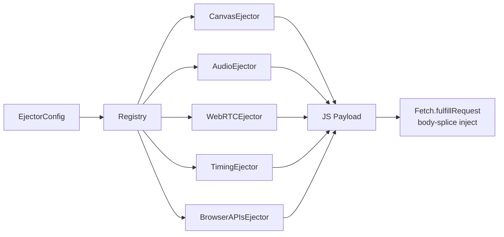

# Anti-Detection Ejecta Framework

The ejecta framework (`stealth/ejecta/`) provides deterministic noise injection for browser fingerprint surfaces. Each ejector generates a JavaScript payload that, when injected into a page, adds seed-derived noise to fingerprint-sensitive APIs.

## Architecture



## Quick Start

```python
from super_browser.stealth.ejecta.config import EjectorConfig
from super_browser.stealth.ejecta.registry import build_ejector_payloads

# Create config — seed determines all noise
config = EjectorConfig(
    seed="my-session-seed",
    canvas_enabled=True,
    audio_enabled=True,
    webrtc_enabled=True,
    timing_enabled=True,
    browser_apis_enabled=True,
)

# Generate all enabled payloads
payloads = build_ejector_payloads(config)
for p in payloads:
    print(f"{p.ejector_id}: {p.size_bytes} bytes, order={p.inject_order}")
```

## Ejectors

### Canvas (`canvas.py`)
- **Noise**: ±2 RGBA per channel
- **Targets**: `toDataURL`, `toBlob`, `getImageData`, `putImageData`, `readPixels`, `OffscreenCanvas`
- **Inject order**: 10

### Audio (`audio.py`)
- **Noise**: ±0.0001 sample magnitude
- **Targets**: `getChannelData`, `getFloatFrequencyData`, `createBuffer`, `OfflineAudioContext`
- **Inject order**: 20

### WebRTC (`webrtc.py`)
- **Action**: Block `RTCPeerConnection`, `webkitRTCPeerConnection`, `mozRTCPeerConnection`
- **Mock**: `navigator.mediaDevices.enumerateDevices` with seed-derived device list
- **Inject order**: 30

### Timing (`timing.py`)
- **Noise**: `performance.now()` floored to configurable precision (default 1ms) + ±0.1ms micro-jitter
- **Offset**: `performance.timeOrigin` shifted by seed-derived ±100ms
- **Math**: `Math.PI`, `Math.SQRT2`, `Math.LOG2E`, `Math.LN10`, `Math.E` perturbed ±1e-15
- **Inject order**: 40

### Browser APIs (`browser_apis.py`)
- **Block**: `navigator.getBattery()` (promise reject), `navigator.permissions.query()` (returns denied)
- **Mock**: `speechSynthesis.getVoices()` with seed-derived voice list
- **Block**: CSS `:visited` style leak via `getComputedStyle` override
- **Jitter**: `getBoundingClientRect()` / `getClientRects()` ±0.5px from PRNG
- **Inject order**: 50

## Configuration

```python
@dataclass(frozen=True)
class EjectorConfig:
    canvas_enabled: bool = True
    canvas_noise_magnitude: int = 2          # ±RGBA
    audio_enabled: bool = True
    audio_noise_magnitude: float = 0.0001    # ±sample
    webrtc_enabled: bool = True
    timing_enabled: bool = True
    timing_precision_ms: int = 1             # performance.now floor
    browser_apis_enabled: bool = True
    profile_id: str = ""
    seed: str = "default"
```

## Determinism

All ejectors use an inline **mulberry32** PRNG seeded from a hash of `config.seed`. Same seed → identical payload bytes. This enables:

- **Reproducible testing**: QA can replay exact noise patterns
- **Session consistency**: Same session always produces same fingerprints
- **Profile locking**: Pair with `FingerprintMatrix` for cross-surface consistency

## Delivery

Payloads are designed for injection via `Fetch.fulfillRequest` body-splice:

```python
# Payloads ordered by inject_order (10, 20, 30, 40, 50)
# Concatenate into page body or inject individually via CDP
for payload in payloads:
    # Each is a self-contained IIFE — no dependencies
    await bridge.evaluate(payload.js_payload)
```

## Validation

The validation suite includes 4 ejector-related checks:

| Check | ID | Severity |
|:------|:---|:---------|
| Canvas_Audio_Consistency | CHK-009 | warning |
| WebRTC_Blocked | CHK-010 | warning |
| Timing_Precision | CHK-011 | warning |
| Browser_APIs | CHK-012 | info |
