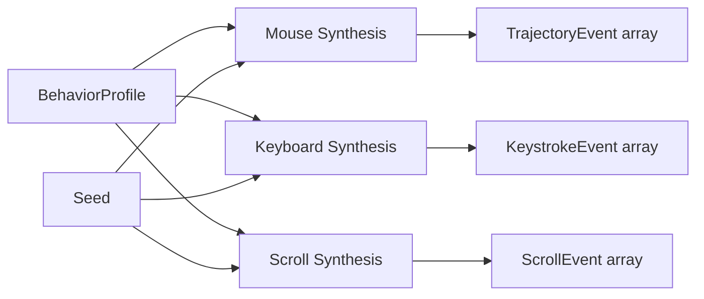

# Biomechanical Behavior Synthesis

## Overview

Behavioral synthesis v2 replaces basic random-jitter human simulation with scientifically grounded models: cubic Bézier mouse trajectories with Fitts's Law timing, QWERTY-aware digraph keystroke delays with lognormal timing and mistake injection, and inertial scroll with exponential friction decay.

All synthesis functions are **pure data** — they take `(options, seed)` and return deterministic event arrays. No browser required for testing.

## Architecture



## Mouse Trajectory

### Algorithm

1. **Cubic Bézier curve** from P0 (start) to P3 (target)
2. **P1, P2 control points** perpendicular to P0→P3, offset by `tremor × distance`
3. **Fitts's Law timing**: MT = 200 + 90 × log₂(D/W + 1) ms
4. **N = ceil(MT × 60)** sample points (60 events/sec)
5. **10% overshoot**: first sub-curve aims past target by 1.05–1.15× D, corrective sub-curve returns
6. **Autocorrelated Gaussian jitter** (τ ≈ 30ms) per frame

### Usage

```python
from super_browser.behavioral import synthesize_mouse_trajectory
from super_browser.behavioral.types import BehaviorProfile

bp = BehaviorProfile(hand="right", tremor=0.18, wpm=65, scroll_style="smooth")
events = synthesize_mouse_trajectory(
    from_pt=(100, 100), to_pt=(800, 600),
    profile=bp, seed="session-1"
)

for event in events:
    print(f"t={event.t_ms:.1f}ms  ({event.x:.1f}, {event.y:.1f})  {event.event_type}")
```

## Keyboard Timing

### Algorithm

1. **Per-character press duration**: Gaussian(80, 25) ms
2. **Digraph delays**:
   - Same-hand: lognormal(4.7, 0.35)
   - Cross-hand: lognormal(4.4, 0.30)
   - After-space: lognormal(4.9, 0.40)
3. **Mistake injection** (2% default): type adjacent wrong key → pause → backspace → correct
4. **WPM scaling**: target_mean = 60000 / (WPM × 5)

### Usage

```python
from super_browser.behavioral import synthesize_keystrokes

events = synthesize_keystrokes(
    text="hello world", profile=bp,
    seed="session-1", mistake_rate=0.02
)
```

## Inertial Scroll

### Algorithm

1. **Initial velocity**: proportional to scroll distance
2. **Exponential friction decay**: v(t) = v₀ × e^(-t/τ), τ = 350ms
3. **Per-frame delta** capped at 100px
4. **Styles**: smooth/inertial → main path; stepped → round to 100px chunks

### Usage

```python
from super_browser.behavioral import synthesize_scroll

events = synthesize_scroll(from_pos=0, to_pos=500, profile=bp, seed="session-1")
```

## Determinism

All functions are deterministic — same `(options, seed)` produces byte-identical output:

```python
events1 = synthesize_mouse_trajectory(from_pt=(0,0), to_pt=(500,500), seed="test")
events2 = synthesize_mouse_trajectory(from_pt=(0,0), to_pt=(500,500), seed="test")
assert events1 == events2  # Always True
```

PRNG isolation: each synthesis category ("mouse", "keys", "scroll") uses a separate PRNG instance seeded with SHA-256 of `"behavioral:{category}:{seed}"`.
