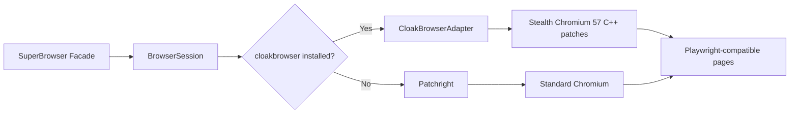

# CloakBrowser Integration Guide

Super Browser supports **CloakBrowser** as an optional stealth backend. When installed, CloakBrowser replaces Patchright's Chromium with a hardened browser that includes 57 C++ stealth patches, achieving ~0.9 reCAPTCHA v3 scores out of the box.

## Installation

```bash
# Install Super Browser with CloakBrowser support
pip install super-browser[browser,cloak]

# Or add to an existing installation
pip install cloakbrowser>=0.3
```

## How It Works

When CloakBrowser is installed:

1. **Auto-detection** — `BrowserSession` detects `cloakbrowser` at runtime
2. **Automatic launch** — Uses `cloakbrowser.launch_async()` instead of Patchright
3. **Graceful fallback** — If CloakBrowser fails for any reason, falls back to Patchright

No code changes required. Your existing scripts work identically.

## Configuration

### Via Config object

```python
from super_browser import Config

config = Config.from_dict({
    "cloak": {
        "cloak_enabled": True,           # Auto-detect (default: True)
        "cloak_humanize": True,           # Human-like mouse/keyboard
        "cloak_humanize_preset": "careful",  # "default" | "careful"
        "cloak_fingerprint_seed": 42,      # Persistent browser identity
        "cloak_geoip": True,               # Auto-detect timezone/locale from proxy
        "cloak_platform": "windows",       # Override platform fingerprint
    }
})
```

### Via environment variables

```bash
export SB_CLOAK_ENABLED=true
export SB_CLOAK_HUMANIZE=true
export SB_CLOAK_HUMANIZE_PRESET=careful
export SB_CLOAK_FINGERPRINT_SEED=42
export SB_CLOAK_GEOIP=true
export SB_CLOAK_PLATFORM=windows
```

### Via YAML

```yaml
cloak:
  cloak_enabled: true
  cloak_humanize: true
  cloak_humanize_preset: careful
  cloak_fingerprint_seed: 42
  cloak_geoip: true
  cloak_platform: windows
```

## Configuration Reference

| Field | Type | Default | Description |
|-------|------|---------|-------------|
| `cloak_enabled` | `bool` | `True` | Enable CloakBrowser auto-detection. Set `False` to force Patchright. |
| `cloak_humanize` | `bool` | `False` | Enable human-like mouse movements, keyboard delays, and scrolling. |
| `cloak_humanize_preset` | `str` | `"default"` | Humanize behavior preset: `"default"` (fast) or `"careful"` (slow, realistic). |
| `cloak_fingerprint_seed` | `int` or `None` | `None` | Persistent browser fingerprint. Same seed = same identity across launches. `None` = random per launch. |
| `cloak_geoip` | `bool` | `False` | Auto-detect timezone, locale, and geolocation from proxy IP. Requires proxy. |
| `cloak_platform` | `str` or `None` | `None` | Override platform fingerprint: `"windows"`, `"macos"`, or `"linux"`. `None` = auto-detect. |

## Explicit Mode Selection

You can force a specific backend using `SessionMode`:

```python
from super_browser.browser import SessionConfig, SessionMode

# Force CloakBrowser (raises ImportError if not installed)
config = SessionConfig(mode=SessionMode.CLOAK_LAUNCH)

# Force Patchright (even if CloakBrowser is installed)
config = SessionConfig(mode=SessionMode.PATCHRIGHT_LAUNCH)
```

## Checking the Active Backend

```python
from super_browser import SuperBrowser

async with SuperBrowser() as sb:
    print(sb.stealth_backend)  # "cloak" or "patchright"
```

## Features

### Human Behavior Simulation

When `cloak_humanize=True`, CloakBrowser adds:

- Randomized mouse trajectories with bezier curves
- Variable typing speed with natural pauses
- Realistic scroll patterns
- Random idle delays between actions

### Fingerprint Persistence

Setting `cloak_fingerprint_seed` to a fixed integer creates a persistent browser identity:

- Same WebGL fingerprint
- Same canvas fingerprint
- Same audio context fingerprint
- Consistent navigator properties

Use different seeds for different "personas".

### GeoIP Auto-Detection

When `cloak_geoip=True` and a proxy is configured, CloakBrowser:

1. Resolves the proxy IP's geographic location
2. Sets matching timezone and locale
3. Configures geolocation to match

### Platform Override

Override the detected platform to prevent fingerprinting:

```python
config = Config.from_dict({
    "cloak": {"cloak_platform": "windows"}
})
```

## Architecture



Both CloakBrowser and Patchright produce standard Playwright pages, so CDPBridge, PageHandle, and all existing tools work without modification.

## Troubleshooting

### "cloakbrowser not installed" but it is

Ensure you're using the right Python environment:

```bash
python -c "import cloakbrowser; print(cloakbrowser.__version__)"
```

### CloakBrowser launch fails

Check the logs for `CloakBrowser launch failed — falling back to Patchright`. Common causes:

- Chromium binary not downloaded: run `python -m cloakbrowser install`
- Version mismatch: `pip install --upgrade cloakbrowser`

### Force Patchright

```python
from super_browser.config import Config

config = Config.from_dict({"cloak": {"cloak_enabled": False}})
```

## Compatibility

| Super Browser | CloakBrowser | Status |
|--------------|-------------|--------|
| >= 1.3.0 | >= 0.3 | Supported |
| < 1.3.0 | any | Not supported |

## License

CloakBrowser is a separate package with its own license. This integration does not bundle or redistribute the CloakBrowser binary.
