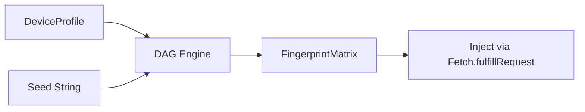

# Fingerprint Consistency Engine

## Overview

The consistency engine replaces independent randomization with a deterministic rule DAG that derives every fingerprint surface from a single `(profile, seed)` pair. This is the core innovation adopted from [Mochi.js](https://github.com/nicholasgriffintn/mochi) — cross-surface consistency beats raw evasion.

## Architecture



### Key Components

| Module | Purpose |
|:-------|:--------|
| `stealth/profiles/` | Device profile schema + 4 real-device JSON profiles |
| `stealth/consistency/rule.py` | Rule protocol + DAG validation |
| `stealth/consistency/dag.py` | Topological sort + acyclicity check |
| `stealth/consistency/derive.py` | `derive_matrix(profile, seed)` — main entry point |
| `stealth/consistency/prng.py` | xoshiro256** PRNG for reproducible randomness |
| `stealth/consistency/matrix.py` | `FingerprintMatrix` frozen dataclass (57 fields) |

### Usage

```python
from super_browser.stealth.profiles import load_profile, list_profiles
from super_browser.stealth.consistency.derive import derive_matrix

# List available profiles
profiles = list_profiles()
# ['linux-chrome-stable', 'macos-chrome-stable', 'macos-m4-chrome-stable', 'windows-chrome-stable']

# Derive a complete fingerprint matrix
profile = load_profile("windows-chrome-stable")
matrix = derive_matrix(profile, "my-session-seed")

# Access derived surfaces
print(matrix.user_agent)           # Full UA string
print(matrix.webgl_unmasked_vendor) # GPU vendor
print(matrix.hardware_concurrency)  # CPU cores
print(matrix.fonts)                # Font list
```

### Consistency Rules (38 total)

The DAG contains 38 rules across 9 categories:

| Category | Rules | Example |
|:---------|:------|:--------|
| Screen | 6 | DPR matches display.dpr, viewport within screen bounds |
| WebGL | 5 | Vendor matches GPU, extensions match OS |
| Fonts | 4 | No Mac fonts on Linux, count matches OS |
| Audio | 4 | Sample rate matches profile, channels consistent |
| Navigator | 6 | Platform matches OS, vendor matches browser |
| Storage | 4 | Quota matches disk, usage realistic |
| Connection | 3 | Effective type consistent with downlink/RTT |
| Behavior | 4 | Hand/tremor/WPM/scroll_style match profile |
| Security | 2 | webdriver=false, cookieEnabled=true |

### Profiles

Four real-device profiles shipped:

| Profile ID | OS | Chrome | GPU | Cores |
|:-----------|:---|:-------|:----|:------|
| `windows-chrome-stable` | Windows 11 | 125-130 | NVIDIA RTX 3080 | 8 |
| `macos-chrome-stable` | macOS 14 | 125-130 | Intel Iris | 8 |
| `macos-m4-chrome-stable` | macOS 15 (ARM) | 125-130 | Apple M4 GPU | 10 |
| `linux-chrome-stable` | Ubuntu 22.04 | 125-130 | NVIDIA GTX 1660 | 6 |
