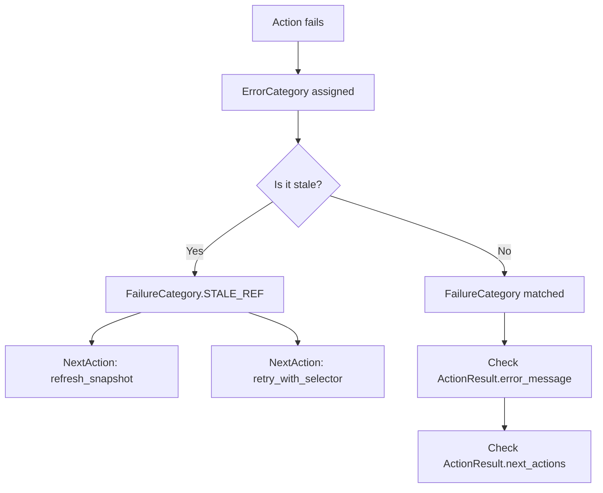

# Error Catalog

> **Super Browser** v1.9.3 — Complete failure taxonomy, causes, and recovery guidance.

Every `ActionResult` carries structured error information. This catalog maps each error category to its typical causes and recommended recovery strategy.

## Error Categories

### ErrorCategory (8 base categories)

The foundational taxonomy. Every error maps to exactly one `ErrorCategory`.

| Category | Value | Typical Cause | Recovery |
|:---------|:------|:--------------|:---------|
| `TIMEOUT` | `"timeout"` | Page load, selector wait, or action exceeded time limit | Increase timeout, check network, simplify page |
| `SELECTOR_NOT_FOUND` | `"selector_not_found"` | No element matches the CSS/XPath selector | Use `observe()` to re-snapshot, try self-healing selectors |
| `NAVIGATION` | `"navigation"` | URL navigation failed (DNS, SSL, redirect loop) | Check URL, verify network, check redirect chain |
| `SECURITY` | `"security"` | Blocked by security policy (domain filter, prompt injection detected) | Review security config, update allow/deny lists |
| `BROWSER_CRASH` | `"browser_crash"` | Browser process terminated unexpectedly | Restart browser, check system resources |
| `VALIDATION` | `"validation"` | Input validation failed (invalid URL, bad selector syntax) | Fix input parameters |
| `CONTEXT_OVERFLOW` | `"context_overflow"` | LLM context window exceeded | Use `observe()` for compact snapshot, reduce history |
| `UNKNOWN` | `"unknown"` | Unclassified error | Check `ActionResult.error_message` for details |

### FailureCategory (13 categories)

Refined superset of ErrorCategory. Includes 5 additional values for finer-grained recovery signals.

**Inherited from ErrorCategory** (same values, same guidance):
`TIMEOUT`, `SELECTOR_NOT_FOUND`, `NAVIGATION`, `SECURITY`, `BROWSER_CRASH`, `VALIDATION`, `CONTEXT_OVERFLOW`, `UNKNOWN`

**FailureCategory-exclusive:**

| Category | Value | Typical Cause | Recovery |
|:---------|:------|:--------------|:---------|
| `STALE_REF` | `"stale_ref"` | Element reference expired (page changed, DOM mutated) | Re-snapshot page, retry with fresh selector |
| `ELEMENT_OBSCURED` | `"element_obscured"` | Element exists but covered by overlay, modal, or toast | Dismiss overlay first, scroll element into view |
| `FRAME_DETACHED` | `"frame_detached"` | iframe was removed during action | Re-enter frame, or handle frame removal |
| `AUTH_REQUIRED` | `"auth_required"` | Login wall or CAPTCHA encountered | Complete auth flow, use CAPTCHA detection |
| `RATE_LIMITED` | `"rate_limited"` | Server returned HTTP 429 or equivalent | Back off, rotate proxy/user-agent, retry after delay |

### SuccessCategory (5 categories)

Positive outcomes. Tells you what *kind* of success occurred.

| Category | Value | Meaning |
|:---------|:------|:--------|
| `NAVIGATION` | `"navigation"` | Page navigated to a new URL |
| `MUTATION` | `"mutation"` | DOM changed without navigation (element added/removed) |
| `INSPECTION` | `"inspection"` | Read-only query succeeded (snapshot, evaluate) |
| `ARTIFACT` | `"artifact"` | Screenshot or download produced |
| `UNCHANGED` | `"unchanged"` | Action succeeded but page state unchanged |

## Stale Reference Detection

`StaleRefDetector` recognizes **10 error signatures** from Playwright/CDP error messages. When any of these appear, the error is classified as `STALE_REF` with automatic recovery guidance.

| # | Signature | Browser Scenario |
|:--|:----------|:-----------------|
| 1 | `"waiting for selector"` | Selector query timed out — element was removed |
| 2 | `"Execution context was destroyed"` | JavaScript context invalidated by navigation |
| 3 | `"Target closed"` | Page or frame closed during action |
| 4 | `"Frame was detached"` | iframe removed from parent document |
| 5 | `"Element is not attached"` | Element exists in memory but not in DOM |
| 6 | `"Node is detached"` | DOM node disconnected from document tree |
| 7 | `"detached from document"` | Similar to above, CDP variant |
| 8 | `"strict mode violation"` | Selector matched multiple elements unexpectedly |
| 9 | `"Timeout"` | Generic timeout during element interaction |
| 10 | `"not found"` | Element lookup failed entirely |

**Automatic recovery**: When `STALE_REF` is detected, `ActionResult.next_actions` is populated with:
- `refresh_snapshot` — re-observe the page to get fresh selectors
- `retry_with_selector` — retry the same action with a new selector from the snapshot

## NextAction Structure

Every failure can carry pre-validated recovery hints:

```python
@dataclass
class NextAction:
    action_id: str           # "refresh_snapshot", "retry_with_selector", etc.
    description: str         # Human-readable guidance
    compiled_args: dict      # Pre-validated kwargs for the recovery action
```

Example:

```python
result = await sb.click("#submit-button")
if result.failure_category == FailureCategory.STALE_REF:
    for hint in result.next_actions:
        print(f"Recovery: {hint.action_id} — {hint.description}")
        # Recovery: refresh_snapshot — Re-observe page to get fresh selectors
        # Recovery: retry_with_selector — Retry click with updated selector
```

## Error Flow



## Completion Reasons (delegate/act)

For multi-step operations (`act()`, `delegate()`), termination is classified by `CompletionReason`:

| Reason | Value | Meaning |
|:-------|:------|:--------|
| `SUCCESS` | `"success"` | All tasks completed successfully |
| `BUDGET_EXHAUSTED` | `"budget_exhausted"` | Token/cost budget depleted |
| `ERROR` | `"error"` | Unrecoverable error during execution |
| `CANCELLED` | `"cancelled"` | Operation was cancelled |
| `MAX_STEPS` | `"max_steps"` | Step limit reached without completion |
