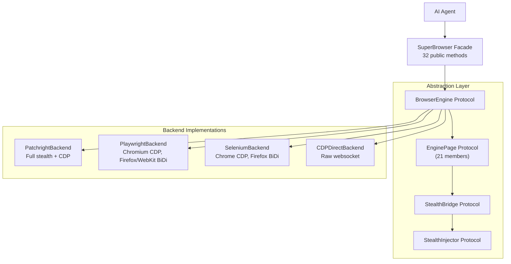

# Platform Abstraction

Super Browser v1.9.0 introduces a **platform abstraction layer** that makes the library browser-agnostic. Agents interact through protocols; the underlying browser engine is a deployment detail.

## Architecture



## Protocols

### BrowserEngine

The top-level protocol managing browser lifecycle.

| Method | Purpose |
|:-------|:--------|
| `start(config)` | Launch or connect to browser |
| `stop()` | Close browser, release resources |
| `new_page()` | Create a new page/tab |
| `capabilities` | Report what the engine supports |
| `backend_name` | Return the backend identifier |

### EnginePage (21 members)

All page operations. Every backend implements these identically.

**Navigation:** `goto`, `title`, `url`, `close`, `content`  
**Interaction:** `click`, `fill`, `select_option`, `hover`, `drag_and_drop`, `scroll`, `type_text`, `press_key`, `set_input_files`  
**Evaluation:** `evaluate`, `screenshot`  
**Routing:** `route`, `unroute_all`  
**Frames/Downloads:** `frame_locator`, `expect_download`  
**Stealth:** `stealth_bridge` (property, None if unavailable)

### StealthBridge

Optional low-level access for stealth features. Only available when the browser supports CDP or BiDi.

| Method | Purpose |
|:-------|:--------|
| `cdp_send(method, params)` | Send raw CDP command |
| `inject_script_before_load(js)` | Inject JS before page scripts |
| `get_ax_tree()` | Get full accessibility tree |
| `get_all_cookies()` | Get all browser cookies |
| `set_cookies(cookies)` | Set browser cookies |
| `capture_screenshot_cdp(params)` | CDP screenshot with params |

### EngineCapabilities

Feature flags for graceful degradation.

| Flag | Meaning |
|:-----|:--------|
| `cdp` | Chrome DevTools Protocol available |
| `bidi` | WebDriver BiDi available |
| `stealth_inject_before` | Can inject JS before page scripts |
| `stealth_inject_after` | Can inject JS after page scripts |
| `network_intercept` | Can intercept/modify requests |
| `multi_tab` | Supports multiple tabs |
| `screenshots` | Can capture screenshots |

## Backend Selection

```python
from super_browser import SuperBrowser
from super_browser.config import Config
from super_browser.browser.config import SessionConfig

# Auto-detect (recommended)
browser = SuperBrowser()

# Explicit backend via composition root
browser = SuperBrowser(Config(browser=SessionConfig(backend="playwright")))

# Remote CDP endpoint
browser = SuperBrowser(Config(browser=SessionConfig(backend="cdp", endpoint="ws://chromium:9222")))
```

Auto-detection precedence:
1. Explicit `config.backend` (not "auto")
2. `config.mode` matching (PATCHRIGHT_LAUNCH → "patchright")
3. Import probe: patchright → playwright → selenium
4. RuntimeError with install instructions

## Stealth Degradation

Stealth features degrade gracefully based on backend capabilities:

| Capability | Patchright | Playwright Chromium | Playwright Firefox | Selenium Chrome | CDP Direct |
|:-----------|:----------|:--------------------|:-------------------|:----------------|:-----------|
| Before-page injection | ✓ | ✓ | — | ✓ | ✓ |
| After-page injection | ✓ | ✓ | ✓ | ✓ | ✓ |
| Route interception | ✓ | ✓ | ✓ | — | ✓ |
| CDP stealth | ✓ | ✓ | — | ✓ | ✓ |
| BiDi injection | — | — | Future | — | — |

JS ejector payloads are **platform-independent** — they're JavaScript strings. Only the delivery mechanism differs across backends.

## Injector Selection

StealthInjector implementations are selected automatically based on EngineCapabilities:

| Capabilities | Injector | Timing |
|:-------------|:---------|:-------|
| `cdp=True` | CDPInjector | BEFORE (Fetch body-splice) |
| `bidi=True` | BiDiInjector | BOTH (future) |
| neither | PageScriptInjector | AFTER (addInitScript) |

## Writing a Custom Backend

> **Note: BiDi Injector** — The `BiDiInjector` class exists as a stub for future WebDriver BiDi protocol support (Firefox/WebKit). It raises `NotImplementedError` on all methods. When BiDi support is added, it will use `script.addPreloadScript` for stealth delivery. No timeline is set for this work.

Implement the three core protocols:

```python
from super_browser.browser.engine import BrowserEngine, EnginePage, StealthBridge

class MyEngine:
    async def start(self, config): ...
    async def stop(self): ...
    async def new_page(self) -> EnginePage: ...
    @property
    def capabilities(self): ...
    @property
    def backend_name(self) -> str: return "my-engine"

class MyPage:
    # Implement all 21 EnginePage members
    async def click(self, selector, **kwargs): ...
    async def evaluate(self, expression): ...
    # ... etc
```

## Known Limitations

### CDP Backend

The raw CDP backend (`--backend cdp`) has limited page-interaction support:

| Method | Status |
|:-------|:-------|
| `set_input_files` | Raises `NotImplementedError` — use Patchright/Playwright for file uploads |
| `frame_locator` | Raises `NotImplementedError` — frame scoped selectors not available via raw CDP |
| `expect_download` | Raises `NotImplementedError` — download monitoring requires higher-level browser API |

### Selenium Backend

The Selenium backend does not support network interception:

| Method | Status |
|:-------|:-------|
| `route()` | Raises `NotImplementedError` — Selenium has no equivalent to Playwright's route interception |
| `unroute()` | Raises `NotImplementedError` — see above |

For full feature coverage, use the Patchright backend (`pip install super-browser[patchright]`).
